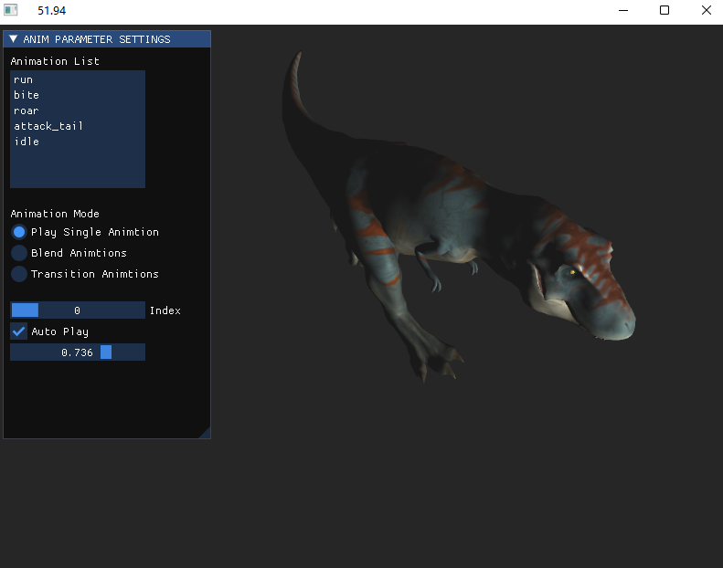
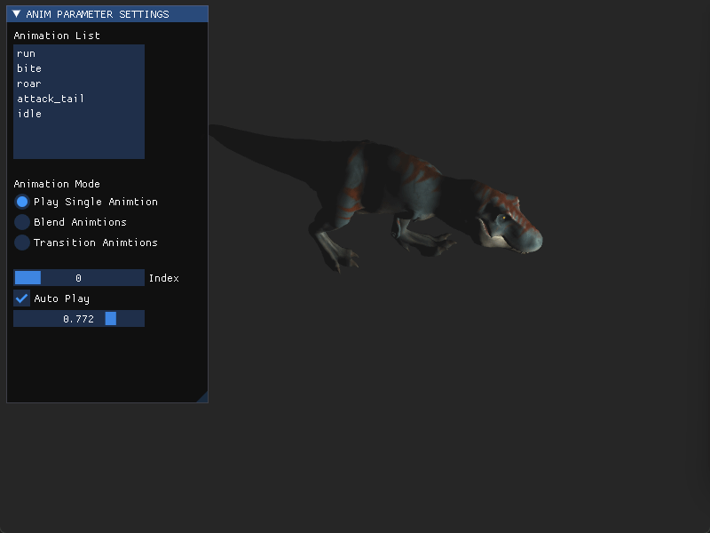

## Skinned Mesh Animation Viewer

This is an application written in C++ used to load and view 3D models and their skinned mesh animations. This application provides basic animation system functions: playing single animation, blending animations, and smoothly transitioning between animations.

Dependencies: Opengl, glfw, imgui, glm

 

### Sample Graph:

Play Single Animation:

Animation Blend:

Animation Transition:
